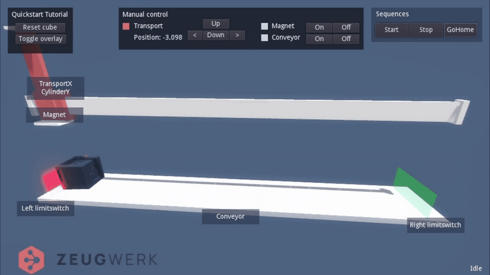

# Zeugwerk Development Kit

## Introduction

We at Zeugwerk GmbH are a team of experts in the field of modern software engineering in automation.
We support companies in developing automation software based on modern concepts and standardization. The aim is to be able to deliver sustainably stable, error-free software in short intervals.

With the products **Zeugwerk Framework** and **Zeugwerk Creator**, Zeugwerk offers a fully integrated application framework for the structured development of PLC software.
Zeugwerk Framework is a set of libraries together with an application template. The libraries are programmed fully object-oriented, which facilities modularization and reusability. Libraries and applications have a consistent, 
modern architecture and have well-defined external interfaces. Furthermore the framework is automatically unit- and integration tested via Continuous Integration.
In addition to the fully integrated Zeugwerk application, all framework objects can be easily used in existing PLC projects, adding immediate value to legacy applications. The latter also facilitates the transition from classical PLC programming to framework-driven, object-oriented programming substantially.
Zeugwerk Creator is an extension of the development environment (TwinCAT XAE Shell). The additional functions it extends the IDE with, make developing of a framework-based application a piece of cake.

## Quickstart

To get started quickly, we created **Zeugwerk Development Kit**. It contains the PLC libraries and the application template, which together form the Zeugwerk Framework. Moreover, it installs Zeugwerk Creator as an extension of the TwinCAT XAE Shell development environment for fast, error-free development.
Additionally, to show you how it feels to develop a Zeugwerk application, it includes the template for a Quickstart application and an interactive, virtual model for commissioning.

Download <a href="https://doc.zeugwerk.dev/quickstart/quickstart.html">Zeugwerk-Development-Kit CE</a> (Community Edition) and then walkthrough the <a href="https://doc.zeugwerk.dev/quickstart/quickstart.html">Quickstart guide</a>.

  

    <figure>
      
      <figcaption>Virtual model of the PLC that is developed in the Quickstart Tutorial</figcaption>
    </figure>
  

 
The framework libraries of the Community Edition are fully functional for 4 hours, then the runtime is switched to config mode. The Community Edition is to be used for non-commercial purposes only.

## Documentation

The Zeugwerk Framework offers extensive documentation.
- <a href="https://doc.zeugwerk.dev/index.html">Overview Community and Pro Edition</a>
- <a href="https://doc.zeugwerk.dev/quickstart/quickstart.html">Getting started with Zeugwerk (Quickstart)</a>
- <a href="https://doc.zeugwerk.dev/reference/ZCore/BaseTypes/Conversion/ZBytes2.html">API reference</a>
- <a href="https://doc.zeugwerk.dev/userguide/tutorials/tutorials.html">User Guide (Tutorials, Overview, Concepts, ...)</a> 

## License

For commercial use, the Zeugwerk products are available as a 'Pro' version. Different license models are available for this, please <a href="https://www.zeugwerk.at/kontakt/">contact us</a> for an individual offer.

The Community Edition is to be used for non-commercial purposes only.

The <a href="https://www.zeugwerk.at/wp-content/uploads/sites/43/2022/03/AGB_ZeugwerkGmbH_V2.pdf">general terms and conditions</a> and <a href="https://www.zeugwerk.at/wp-content/uploads/sites/43/2022/03/ASB_ZeugwerkGmbH_V2.pdf">software conditions</a> for the Zeugwerk products can be found on the <a href="https://www.zeugwerk.at">Zeugwerk website</a>.

## Contact

Matthias Pfurtscheller | Matthias Seehauser 
+43 512 209132 
<a href="mailto:info@zeugwerk.at">info@zeugwerk.at</a> | <a href="https://zeugwerk.at">zeugwerk.at</a> 
Zeughausgasse 3 
6020 Innsbruck, AUT 
